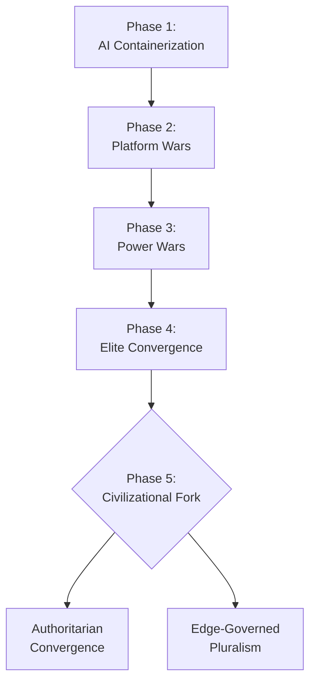
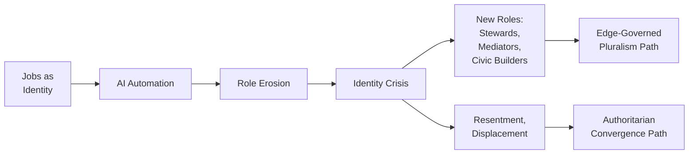
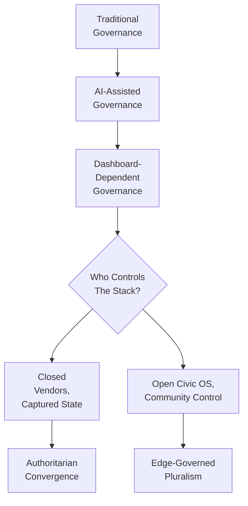
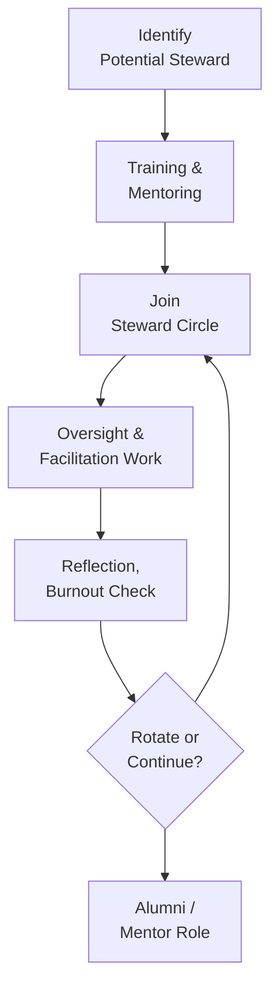

# Infographics Pack v1 — CoTheory of Civilization

All diagrams are minimalist, line/box/connector style, using Mermaid or D2.
They are designed to be copy-pasted into:
- GitHub markdown
- Docs sites (Docusaurus/MkDocs)
- Slides
- Zenodo appendices

---

## 1. Civilizational Phases (Mermaid)



---

## 2. Actor Landscape (D2)

```d2
tech: {
  label: "Tech-State Complex"
}
auth: {
  label: "Authoritarian Sovereigns"
}
reg: {
  label: "Regulatory Hubs"
}
cap: {
  label: "Capital Pools"
}
civic: {
  label: "Civic Commons & Stewards"
}

tech -> auth: "competition,\ncopying tools"
tech -> reg: "lobbying,\nstandard-setting"
tech -> cap: "returns,\nexits"
auth -> tech: "market access,\nconstraints"
reg -> tech: "rules,\npenalties"
cap -> tech: "investment,\npressure"
civic -> tech: "audit,\ncritique,\nco-design"
civic -> reg: "advocacy,\npublic input"
civic -> auth: "resistance,\nexposure"
```

---

## 3. Identity & Work Transformation (Mermaid)



---

## 4. Governance Drift (Mermaid)



---

## 5. Truth Mesh (D2)

```d2
source_journalism: {
  label: "Investigative\nJournalism"
}
source_science: {
  label: "Scientific\nEvidence"
}
source_civic: {
  label: "Civic\nObservation"
}
source_local: {
  label: "Lived\nExperience"
}
ai_node: {
  shape: circle
  label: "AI\nSynthesis Node"
}
public: {
  label: "Public\nDeliberation"
}

source_journalism -> ai_node
source_science -> ai_node
source_civic -> ai_node
source_local -> ai_node
ai_node -> public: "summaries,\nmultiple views"
public -> ai_node: "feedback,\ncorrections,\nnew data"
```

---

## 6. Steward Lifecycle (Mermaid)



---

## 7. Coercion Loop Under AI (D2)

```d2
citizen: {
  label: "Citizen"
}
data: {
  label: "Behavioral\nData"
}
model: {
  label: "Risk /\nLoyalty Model"
}
policy: {
  label: "AI-Mediated\nPolicy"
}
impact: {
  label: "Life Impact\n(Access,\nRates,\nFreedom)"
}

citizen -> data: "actions,\nspeech,\nlocation"
data -> model: "training,\nupdates"
model -> policy: "scores,\nclassifications"
policy -> impact: "sanctions,\nrewards"
impact -> citizen: "behavior change,\nself-censorship"
```

---

## 8. Civic OS Stack (Mermaid)

```mermaid
flowchart TD
    L[Local Community,\nOrg,\nCity] --> C[Local Civic OS\n(Policies,\nPlaybooks,\nConstitutions)]
    C --> A[AI Systems\n(Models,\nTools,\nWorkflows)]
    A --> R[Receipts,\nLogs,\nReports]
    R --> S[Steward Circle]
    S --> U[Updates to Civic OS]
    U --> C
```
